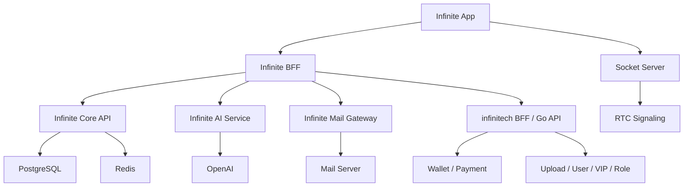

# Infinite

> Infinite 是燧石创想工作室面向校园与本地生活场景打造的品牌级超级 App。  
> 它以社交为入口，连接即时通讯、悦享 e 食、本地支付、AI 助手、品牌邮箱与统一账户体系。

## 项目状态

| 项目 | 状态 |
| --- | --- |
| 产品定义 | 进行中 |
| 技术架构 | 已确定主路线 |
| 代码实现 | 即将启动 |
| 当前仓库定位 | `Infinite` 主仓库 / 产品与实现入口 |

---

## 一句话说明

`Infinite` 不是把多个页面简单放进一个壳里，而是一个拥有独立品牌、独立后台、独立社交关系和独立 AI 能力的超级 App。

它会复用 `悦享e食` 现有的业务底座，但不会沦为 `悦享e食` 的附属页面集合。

---

## 产品定位

Infinite 面向用户提供 6 个底部导航主入口：

| 页面 | 功能定位 | 第一阶段目标 |
| --- | --- | --- |
| 聊天 | 社交主入口，好友、消息、图片、表情、通话 | 做成日常高频入口 |
| e 食 | 接入悦享 e 食平台 | H5 套壳快速上线 |
| if-pay | 余额、充值、提现、转账 | 复用钱包核心能力 |
| AI | `infinite-5.4` 品牌 AI 助手 | 文本对话 + 图片输入 |
| 邮箱 | `@infiniteco.cn` 品牌邮箱 | 账号分配 + 收发能力 |
| 我的 | 账户中心、身份状态、平台资料 | 统一个人中心 |

---

## 核心价值

- 用一个统一账号打通社交、本地生活、支付、AI 和邮箱。
- 让 `悦享e食` 成为 Infinite 生态中的业务能力，而不是唯一产品主体。
- 通过独立品牌与独立后台，为后续平台化扩展预留空间。

---

## 目标用户

- 校园用户
- 悦享 e 食普通用户
- 悦享 e 食 VIP 用户
- 骑手
- 管理员
- 未来合作商户与校内组织用户

---

## 功能总览

## 1. 聊天

聊天是 Infinite 的主入口，不是边缘功能。

支持能力：

- 添加好友
- 好友搜索
- 单聊会话
- 实时消息
- 表情发送
- 图片发送
- 消息状态回执
- 未读数
- 推送提醒
- 发起 1v1 音视频通话

### 通话目标

用户层面定义为 “P2P 打电话”，技术层面建议按以下标准落地：

- 1v1 WebRTC
- 优先 P2P 直连
- 必须具备 TURN 中继兜底
- 通话状态与信令通过实时服务统一协调

这样既符合产品表达，也能保证在复杂网络环境下的真实可用性。

## 2. e 食

`e 食` 页用于接入悦享 e 食平台。

第一阶段方案：

- H5 套壳接入
- OAuth 一键登录
- 支持深链跳转首页、店铺、订单、支付等关键页面

这样可以最大化复用现有平台能力，缩短 Infinite 首版上线周期。

## 3. if-pay

if-pay 是 Infinite 内的支付与钱包中心。

支持能力：

- 余额查看
- 充值
- 提现
- 转账给好友
- 账单流水
- 安全校验

它应当成为社交场景与本地生活场景之间的资金连接层。

## 4. AI

Infinite 内置品牌 AI 助手：

- 对外名称：`infinite-5.4`
- 对内实现：后端统一代理 OpenAI 接口

AI 支持：

- 文本对话
- 多轮上下文
- 图片上传
- 图片理解
- 每日额度限制
- 后台可配置模型路由

### 使用规则

| 用户类型 | 每日可用次数 |
| --- | --- |
| 普通用户 | 10 次 |
| 悦享 e 食 VIP 用户 | 100 次 |
| 骑手 / 管理员 | 不限次 |

## 5. 邮箱

Infinite 为用户自动分配品牌邮箱：

- 域名：`@infiniteco.cn`
- 支持收件、发件、附件与基础检索

邮箱既是品牌能力，也是账户体系的一部分。

## 6. 我的

“我的”页面是统一账户中心。

包含内容：

- 登录注册
- 头像昵称
- 手机号
- 账号安全
- if-pay 状态
- 邮箱地址
- 悦享 e 食 VIP 状态
- 骑手 / 管理员身份
- 与悦享 e 食的绑定信息

---

## AI 与权限规则

Infinite 的 AI 能力必须由后端统一控制。

后端负责：

- 上游模型地址
- API Key
- 模型别名映射
- 额度统计
- 风控与审计

客户端只看到品牌模型名 `infinite-5.4`，不直接接触任何 OpenAI 上游凭据。

建议后端环境变量：

```env
OPENAI_BASE_URL=
OPENAI_API_KEY=
OPENAI_TEXT_MODEL=
OPENAI_VISION_MODEL=
AI_BRAND_MODEL_NAME=infinite-5.4
```

---

## 与悦享 e 食的关系

Infinite 与悦享 e 食的关系是：

- Infinite：品牌级超级 App
- 悦享 e 食：已存在的本地生活业务底座

Infinite 会复用悦享 e 食的底层业务能力，但 Infinite 仍然保持独立产品身份。

悦享 e 食仓库：

- [HCRXchenghong/infinitech](https://github.com/HCRXchenghong/infinitech)

---

## 已确认可复用的现有能力

基于对 `infinitech` 仓库实际结构的检查，以下能力已经具备明显复用价值：

### 业务与平台层

- `backend/go`
- `backend/bff`
- `backend/alipay-sidecar`
- `backend/bank-payout-sidecar`
- `backend/docker`

### 实时与通话层

- `socket-server/index.js`
- `socket-server/rtcNamespace.js`
- `socket-server/supportNamespaces.js`
- `socket-server/redisState.js`

### 移动端共享层

- `shared/mobile-common/socket.ts`
- `shared/mobile-common/realtime-notify.js`
- `shared/mobile-common/rtc-runtime.js`
- `shared/mobile-common/rtc-media.js`
- `shared/mobile-common/rtc-call-page.js`
- `shared/mobile-common/phone-contact.js`

### 钱包与支付层

- `backend/go/internal/handler/wallet_handler.go`
- `backend/go/internal/handler/payment_handler.go`
- `backend/go/internal/service/wallet_service.go`
- `backend/go/internal/service/wallet_pay_center.go`
- `backend/go/internal/repository/wallet_models.go`

### 账户与身份层

- `backend/go/internal/handler/auth_handler.go`
- `backend/go/internal/service/auth_service.go`
- `backend/go/internal/repository/external_auth_session_model.go`
- `backend/go/internal/repository/unified_id_models.go`

### 消息与上传层

- `backend/go/internal/repository/message_models.go`
- `backend/go/internal/handler/upload_handler.go`
- `backend/go/internal/handler/file_upload_handler.go`

### RTC 审计层

- `backend/go/internal/handler/rtc_call_audit_handler.go`
- `backend/go/internal/repository/rtc_call_audit_model.go`

---

## 最优实现结论

Infinite 的最优实现方式不是重写一套完整平台，而是：

1. 新建 Infinite 独立仓库与独立产品层
2. 复用 infinitech 已有账户、钱包、支付、上传、实时与部分移动端运行时能力
3. 新增 Infinite 自己的社交域、AI 域、邮箱域和独立后台

### 推荐路线

- Infinite 独立品牌
- Infinite 独立 App
- Infinite 独立后台
- Infinite 与悦享 e 食通过 OAuth 与内部 API 打通
- 悦享 e 食作为 Infinite 体系中的业务能力模块存在

### 不推荐路线

不建议继续把所有功能直接堆到 `infinitech/app-mobile` 中。

原因：

- 产品边界会越来越混乱
- 品牌独立性会被削弱
- 后续后台权限、运营策略、社交关系与 AI 额度都难以独立

---

## OAuth 与共享信息

Infinite 需要支持从悦享 e 食一键授权并共享信息。

推荐协议：

- OAuth 2.1
- Authorization Code + PKCE
- 补充 OpenID Connect 风格用户信息接口

推荐共享 Scope：

- `profile.basic`
- `profile.avatar`
- `profile.mobile`
- `wallet.read`
- `vip.read`
- `role.read`
- `address.read`
- `email.bootstrap`

推荐共享字段：

- 用户唯一 ID
- 昵称
- 头像
- 手机号
- VIP 状态
- 骑手身份
- 管理员身份
- 钱包账户 ID
- 钱包状态

不应直接共享的内容：

- 明文支付密码
- 钱包敏感凭证
- 高风险后台权限

---

## 技术架构建议

## 客户端

建议继续沿用与 `infinitech/app-mobile` 一致的方向：

- uni-app
- Vue 3
- TypeScript

原因：

- 已有移动端技术栈沉淀
- 已有实时与 RTC 共享运行时
- Android / iOS 双端交付路径最短

## 后端拆分

推荐拆成以下核心服务：

### `infinite-bff`

职责：

- App 聚合接口
- OAuth 对接 infinitech
- H5 套壳入口配置
- 邮箱与 AI 页面聚合
- 统一鉴权与限流

推荐技术：

- Node.js
- Express

### `infinite-core-api`

职责：

- 好友关系
- 社交会话
- 社交消息
- 通话记录
- AI 配额
- 邮箱映射
- 用户资料聚合

推荐技术：

- Go

### `infinite-ai`

职责：

- OpenAI 代理
- 模型路由
- 额度控制
- AI 审计
- 图片理解

### `infinite-mail-gateway`

职责：

- 邮箱创建
- 邮件读取
- 邮件发送
- 附件管理
- App 与邮件服务器之间的适配

---

## 推荐架构图



---

## 数据域边界

### 继续复用 infinitech 的域

- 账号
- 用户基础资料
- VIP 状态
- 骑手 / 管理员身份
- 钱包
- 充值 / 提现
- 上传
- 支付通道

### Infinite 新建域

- 好友关系
- 私聊会话
- 社交消息
- 消息附件
- 通话会话
- AI 会话
- AI 每日额度
- 邮箱地址映射
- OAuth 绑定记录

---

## 独立后台要求

Infinite 必须有自己的后台系统。

后台至少覆盖以下能力：

- 用户管理
- 好友关系管理
- AI 配额与模型配置
- OpenAI 地址与密钥配置
- 邮箱域与邮箱账号管理
- H5 入口管理
- if-pay 转账审计
- 充值 / 提现审计
- 通话审计
- 消息审计
- OAuth Client 与 Scope 管理

后台原则：

- Infinite 后台独立于悦享 e 食后台
- 但可以复用现有管理员身份体系与部分权限模型

---

## 实时与通话路线

### 第一阶段

- 复用现有 `socket-server`
- 继续使用 Socket.IO
- 继续使用 Redis Adapter
- 继续使用当前 RTC 信令体系

### 第二阶段

在不推翻现有消息系统的前提下，增强音视频稳定性与网络兼容。

推荐优先评估：

- [LiveKit](https://github.com/livekit/livekit)

原因：

- 更适合 1v1 音视频与未来实时扩展
- TURN / 网络兼容能力更成熟
- 后续接入实时 AI、更多通话能力更容易演进

---

## 邮箱基础设施路线

推荐优先评估：

- [docker-mailserver](https://github.com/docker-mailserver/docker-mailserver)

适合原因：

- 自建成本相对可控
- 支持 SMTP / IMAP
- 适合作为第一阶段品牌邮箱底座

邮件域名必须补齐：

- MX
- SPF
- DKIM
- DMARC

---

## AI 后台参考路线

Infinite 前台 AI 页面建议自研并深度品牌化，不建议整站直接套现成 AI Chat。

但后台能力设计可以参考成熟开源项目：

- [LibreChat](https://github.com/danny-avila/LibreChat)

重点参考点：

- 模型切换
- 会话管理
- 提示词与系统配置
- 多模型路由

---

## 建议仓库结构

```text
infinite/
├─ README.md
├─ app-mobile
├─ admin-web
├─ backend
│  ├─ infinite-bff
│  ├─ infinite-core-api
│  ├─ infinite-ai
│  ├─ infinite-mail-gateway
│  └─ docker
├─ shared
└─ docs
```

---

## 开发阶段建议

## Phase 1：可上线 MVP

- 聊天
- 好友
- 图片消息
- 1v1 通话
- e 食 H5 套壳
- if-pay 余额、充值、提现、转账
- AI 文本对话
- AI 图片输入
- 我的
- OAuth 一键登录 / 共享资料

## Phase 2：增强版

- 邮箱收发
- AI 会话归档
- 消息搜索
- 会话置顶 / 免打扰
- 通话历史
- 邮箱附件能力

## Phase 3：平台化

- 群聊
- 群文件
- AI Agent
- 邮箱日历 / 联系人
- 更完整的后台运营体系

---

## 安全原则

- OpenAI 上游地址与密钥只放后端
- 钱包核心账本继续走服务端控制
- OAuth 按 Scope 最小授权
- 通话与消息保留审计能力
- 邮箱与支付等高风险能力必须纳入独立后台管理

---

## 当前结论

如果按现有代码与产品阶段来推进，Infinite 的最佳路线是：

- 独立建仓库
- 独立做品牌
- 独立做后台
- 最大化复用 `infinitech` 的账户、钱包、支付、上传、实时与 RTC 基础
- 把社交、AI、邮箱做成 Infinite 自己的核心差异化能力

这条路线既能延续你现有工程沉淀，也能保证 Infinite 真正成长为一个独立品牌平台。

---

## 关联项目

- 悦享 e 食主仓库：<https://github.com/HCRXchenghong/infinitech>

